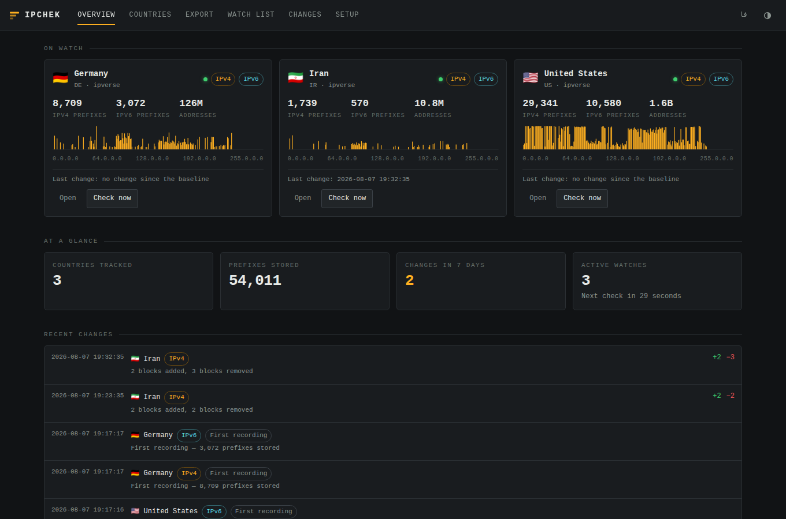
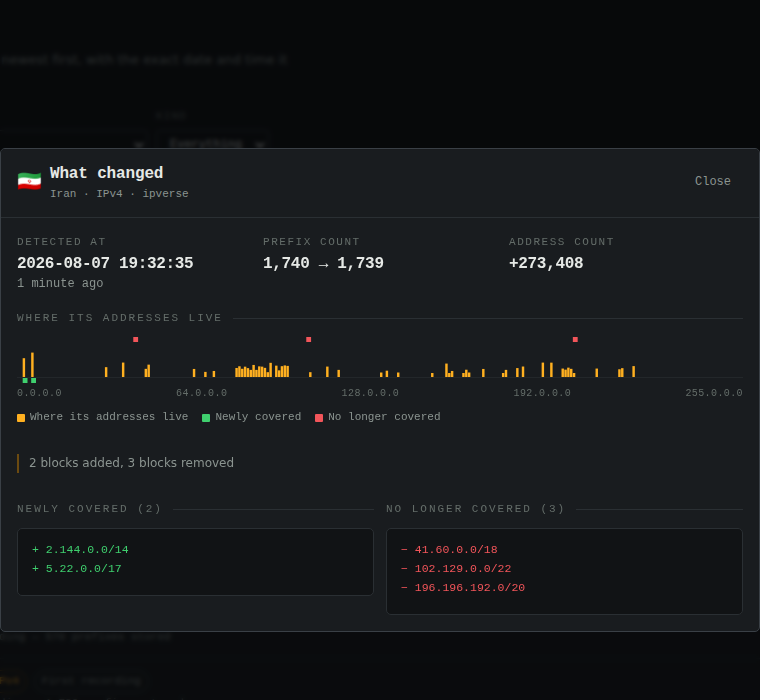
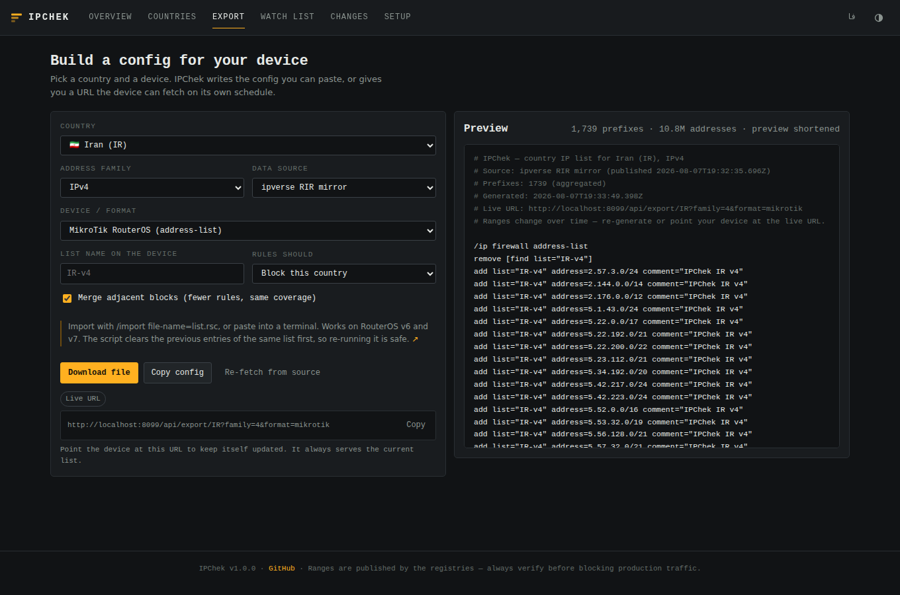
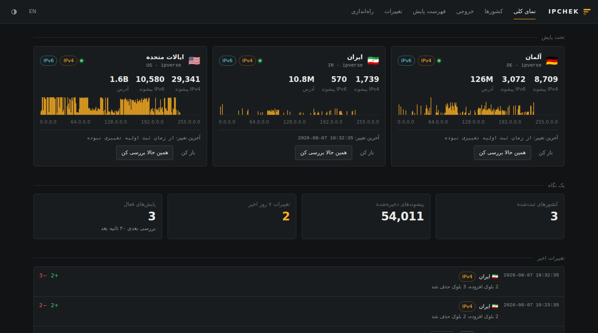

# IPChek

**Country IP ranges, kept current, watched for changes, and written out in your router's own config language.**

Point it at a country and IPChek fetches that country's allocated address space from an
authoritative source, stores it, re-checks it on a schedule, and tells you the moment the
ranges move — with the exact date and time. Then it writes the list out as a MikroTik script,
a FortiGate threat feed, an nftables set, a pfSense alias, or any of 26 formats.

Everything runs from one Node process with a web UI. No account, no external service.

**Want the config without installing anything? → [amirsepehrti.github.io/IPChek](https://amirsepehrti.github.io/IPChek/)**
— the same exporters, running entirely in your browser.



---

## Why

Country IP lists go stale. A registry hands a new /19 to an Iranian ISP, a block moves from
one country to another, and the address-list on your router quietly stops matching reality.
Most tools hand you a text file and leave the rest to you.

IPChek treats the list as something that *changes over time*:

- it keeps the previous state and diffs against it,
- it tells you which blocks appeared and which disappeared, and when,
- it serves a live URL so the device can update itself,
- and it refuses to record a change it does not trust (see [Change detection](#change-detection)).

---

## Quick start

```bash
git clone https://github.com/amirsepehrti/IPChek.git
cd IPChek
npm install
npm start
```

Open <http://localhost:8080>.

With Docker:

```bash
docker compose up -d
```

Or straight from the CLI, no server needed:

```bash
node src/cli.js export IR --format=mikrotik --family=4 > iran.rsc
```

---

## What you get

### 1. Current ranges from a source you choose

| Source | What it is | Best for |
| --- | --- | --- |
| `rir` *(default)* | The daily delegation files published by RIPE NCC, ARIN, APNIC, AFRINIC and LACNIC | The authoritative answer to "who was this block allocated to" |
| `ipverse` | [ipverse/rir-ip](https://github.com/ipverse/rir-ip) — the same RIR data, rebuilt daily, one small file per country over HTTPS | Networks that block the RIR FTP hosts, or when you only track a few countries |
| `ipdeny` | [ipdeny.com](https://www.ipdeny.com/ipblocks/) zone files | Matching what existing firewall scripts already use |
| `dbip` | DB-IP geolocation ranges via [sapics/ip-location-db](https://github.com/sapics/ip-location-db) | Where addresses are *used* rather than who they were allocated to — usually what you want for traffic policy |

`rir` downloads about 35 MB across five files and covers every country at once; the others
fetch per country. Files are cached on disk with conditional requests, so a re-check that
finds nothing new costs one HTTP 304.

If your network blocks the RIR FTP hosts, switch `SOURCE` to `ipverse` — it is the same
underlying data served from GitHub.

### 2. A watch list that notices changes

Add a country to the watch list and IPChek re-checks it on your schedule. Every difference
becomes an event with the exact detection time, the blocks added, the blocks removed, and the
net change in address count.



The strip is the **address-space map**: 256 columns covering the whole IPv4 space, one per /8.
Green ticks mark newly covered blocks, red ticks mark blocks that are gone — so you see not
just *that* something moved but *where*.

Alerts go to Telegram, Slack, Discord or a plain webhook. Set the values in `.env` and restart.

### 3. Config for your device



| | Formats |
| --- | --- |
| **Routers** | MikroTik RouterOS (address-list), MikroTik self-updating script, Cisco IOS/IOS-XE prefix-list, Cisco IOS extended ACL, Juniper Junos, Huawei VRP, VyOS / EdgeOS |
| **Firewalls** | FortiGate address objects + groups, FortiGate Threat Feed, Cisco ASA object-group, Palo Alto PAN-OS, pfSense / OPNsense URL table |
| **Linux** | iptables / ip6tables, ipset, nftables |
| **Windows** | netsh advfirewall, PowerShell `New-NetFirewallRule` |
| **Servers** | nginx (geo map), nginx (allow/deny), HAProxy, Apache 2.4, Squid |
| **Data** | Plain CIDR, start–end ranges, JSON, CSV |

Each one is real config, not a generic list with a header swapped: FortiGate gets
address/netmask pairs and groups chunked to stay under the per-group member limit, Cisco ACLs
get wildcard masks, ipset gets a power-of-two `hashsize` scaled to the list, netsh splits the
prefixes across rules to stay under the argument limit.

Both address families are supported everywhere, and adjacent blocks are merged by default, so
you get the fewest rules that cover the same space. How much that saves depends on the source:
the raw RIR delegation files list every allocation separately and often hand a country several
neighbouring blocks, while `ipverse` and `dbip` already publish merged ranges, where merging
changes nothing. Turn it off with `aggregate=false` to get the source's own split.

For scale: Iran is 1,739 IPv4 prefixes covering 10.8M addresses, Germany 8,709 covering 126M,
the United States 29,341 covering 1.6B (via `ipverse`, August 2026).

---

## Keeping devices updated by themselves

Every export has a stable URL. Point the device at it and it stays current with no work from you.

**MikroTik** — pick the *self-updating script* format, paste it once, and the router installs
a scheduler entry that re-fetches and re-imports daily.

**FortiGate** (6.2+) — pick *Threat Feed*; FortiOS downloads the list itself:

```
config system external-resource
    edit "IR-v4"
        set type address
        set resource "http://ipchek.lan:8080/api/export/IR?family=4&format=plain"
        set refresh-rate 60
    next
end
```

**pfSense / OPNsense** — create an alias of type *URL Table (IPs)* pointing at
`http://ipchek.lan:8080/api/export/IR/plain?family=4` with a 1-day refresh.

**Palo Alto** — use the same URL as an External Dynamic List.

**Linux with ipset** — one cron line:

```cron
17 4 * * * curl -fsS "http://ipchek.lan:8080/api/export/IR/ipset?family=4" | ipset restore
```

---

## Change detection

A monitoring tool that cries wolf is worse than no tool, so IPChek is deliberately
conservative about what counts as a change.

- **Diffs are computed over address space, not prefix strings.** If a registry publishes
  `1.0.0.0/23` one day and `1.0.0.0/24 + 1.0.1.0/24` the next, that is the same space and
  produces no event.
- **An empty response never overwrites a populated list.** If a source returns nothing for a
  country that had ranges yesterday, IPChek records an error and keeps the old data. Pass
  `allowEmpty` if the country really has been emptied.
- **Partial source data is refused.** With `rir`, if one of the five registries is unreachable,
  every country it serves would look like it lost all its space. That is reported as an error
  instead of a mass withdrawal.
- **A failed fetch is an error event, never a change.** Stale cached data is used rather than
  none when the network is down.

Timestamps are stored in UTC with millisecond precision and rendered in your local timezone.

---

## Configuration

Copy `.env.example` to `.env`. Every value has a working default.

| Variable | Default | What it does |
| --- | --- | --- |
| `PORT` / `HOST` | `8080` / `0.0.0.0` | Where the server listens |
| `DATA_DIR` | `./data` | SQLite database and the source cache |
| `SOURCE` | `rir` | Default data source |
| `SYNC_INTERVAL_MINUTES` | `360` | How often watched countries are re-checked; `0` disables the scheduler |
| `SYNC_ON_START` | `true` | Check every watch on boot |
| `SOURCE_CACHE_MINUTES` | `60` | How long a downloaded source file is reused |
| `EVENT_RETENTION` | `500` | Events kept per watch; `0` keeps everything |
| `API_TOKEN` | *(unset)* | When set, anything that changes state needs `Authorization: Bearer <token>`. Reads and exports stay open so devices can fetch |
| `NOTIFY_WEBHOOK_URL` | | JSON POST of the full change payload |
| `NOTIFY_TELEGRAM_BOT_TOKEN` / `NOTIFY_TELEGRAM_CHAT_ID` | | Telegram alerts |
| `NOTIFY_SLACK_WEBHOOK_URL` | | Slack or Mattermost |
| `NOTIFY_DISCORD_WEBHOOK_URL` | | Discord |

---

## API

Everything the UI does is a plain HTTP call.

```
GET  /api/health
GET  /api/meta                        sources, formats, scheduler state
GET  /api/stats                       dashboard totals
GET  /api/countries?q=&continent=     every country with what is stored
GET  /api/countries/:cc               one country, both families, recent events
GET  /api/prefixes/:cc?family=4       JSON prefix list
GET  /api/export/:cc/:format          rendered config  ← point devices here
GET  /api/preview/:cc?format=         rendered config as JSON, for the UI
GET  /api/spacemap/:cc?family=4       256-bucket coverage histogram
GET  /api/monitors                    the watch list
POST /api/monitors                    {country, source, family, intervalMinutes}
POST /api/monitors/:id/sync           check one watch now
POST /api/sync                        {country, source, family, force}
GET  /api/events?country=&type=       change history, newest first
GET  /api/events/:id                  one event with the full block lists
```

Common query parameters for `/api/export`: `family` (`4`|`6`), `source`, `aggregate`
(`true`|`false`), `action` (`block`|`allow`), `list` (object name on the device),
`download=1`, `nocomments=1`, `refresh=1`.

Export responses carry `X-IPChek-Prefixes` and `X-IPChek-Changed-At` headers, so a script can
tell whether anything actually moved before reloading a ruleset.

---

## CLI

```bash
node src/cli.js sync IR --source=rir --family=0     # check both families now
node src/cli.js export IR --format=nftables         # write config to stdout
node src/cli.js events --limit=20                   # change history
node src/cli.js monitors                            # the watch list
node src/cli.js formats                             # every output format
```

---

## Interface

The UI is English and Persian, right-to-left aware, responsive down to a phone, and follows
your system's light or dark preference. There is no build step: it is plain ES modules and
CSS, served straight from `public/`.



---

## The browser-only version

[amirsepehrti.github.io/IPChek](https://amirsepehrti.github.io/IPChek/) is a build with no
backend at all. It fetches the ranges straight from the source, does the CIDR maths and
renders the config in the page — nothing is uploaded, and there is no server to run.

It imports the very same `src/exporters/` and `src/lib/` modules the server does, so the
config it produces is identical. What it cannot do is anything that needs a process running
while you are away:

| | Hosted page | Self-hosted |
| --- | --- | --- |
| All 26 device formats | yes | yes |
| Fetch current ranges | yes | yes |
| Compare against a saved list | in your browser, when you open the page | on a schedule |
| Alerts to Telegram, Slack, webhook | no | yes |
| Change history across devices | no | yes |
| A stable URL your router can poll | no | yes |
| The RIR delegation files as a source | no — the registry servers send no CORS headers | yes |

Build it yourself with `npm run build:static` (output lands in `_site/`), or preview it with
`npm run serve:static`. `scripts/check-static.mjs` walks every import in the assembled site and
fails if one does not resolve — with no bundler, a missing file would otherwise only show up
as a blank page.

---

## Development

```bash
npm install
npm run dev     # restarts on change
npm test        # 65 tests, no network needed
```

The test suite covers the IP maths (v4 and v6 parsing, aggregation, range splitting, set
difference), the RIR file parser, every exporter against both families, the change-detection
guards, and the HTTP API end to end.

Layout:

```
src/lib/ipnet.js       IPv4/IPv6 maths — parsing, aggregation, diffing
src/lib/spacemap.js    the 256-bucket address-space histogram
src/sources/           one module per data source
src/core/sync.js       fetch, compare, record, notify
src/exporters/         one module per device family
src/routes/api.js      the HTTP API
public/                the web UI
```

Adding a device format means adding one object with a `render(ctx)` function to
`src/exporters/` and listing it in `src/exporters/index.js`. The test suite picks it up
automatically.

---

## راه‌اندازی سریع

IPChek محدوده‌های IP هر کشور را از منابع رسمی می‌گیرد، آن‌ها را زیر نظر می‌گیرد و هر تغییر را
با تاریخ و ساعت دقیق ثبت می‌کند — و خروجی آماده را برای میکروتیک، فورتی‌گیت، سیسکو، iptables،
nftables، pfSense و ۲۶ قالب دیگر می‌سازد.

```bash
git clone https://github.com/amirsepehrti/IPChek.git
cd IPChek && npm install && npm start
```

سپس <http://localhost:8080> را باز کنید و از دکمه «فا» زبان را فارسی کنید.

اگر فقط خروجی می‌خواهید و حوصله نصب ندارید، نسخه‌ی بدون سرور آماده است:
**[amirsepehrti.github.io/IPChek](https://amirsepehrti.github.io/IPChek/)** — همان قالب‌های خروجی،
تماماً داخل مرورگر شما. برای پایش زمان‌بندی‌شده و هشدار، نسخه‌ی خودمیزبان بالا را اجرا کنید.

نکته‌ها:

- اگر شبکه‌ی شما به میزبان‌های FTP ریجیستری‌ها دسترسی ندارد، مقدار `SOURCE` را در فایل `.env`
  روی `ipverse` بگذارید؛ همان داده است ولی از روی HTTPS و گیت‌هاب.
- برای اینکه روتر خودش به‌روز بماند، در صفحه «خروجی» قالب «اسکریپت خودبه‌روزرسان میکروتیک» را
  انتخاب کنید یا «آدرس زنده» را مستقیم به دستگاه بدهید.
- برای گرفتن هشدار هنگام تغییر، مقادیر تلگرام یا وب‌هوک را در `.env` تنظیم و سرویس را دوباره
  اجرا کنید.

---

## Notes

Range data belongs to the registries and providers listed above; DB-IP data is CC BY 4.0 and
requires attribution if you redistribute it. Allocation records and geolocation are not the
same thing and neither is a perfect map of where traffic really comes from — check before you
block production traffic.

MIT licensed. See [LICENSE](LICENSE).
